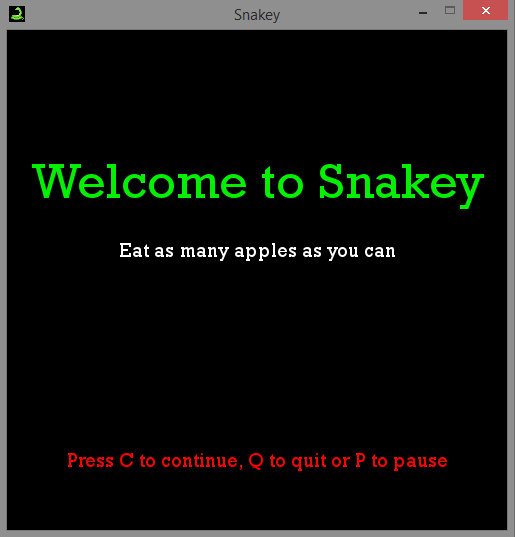

# SnakeGame
> the classic snake game 

</br>

The player uses the arrow keys to move a "snake" around the board. The game ends when the snake either moves off the screen or moves into itself. The goal is to make the snake as large as possible before that happens.
<p float="left">



</p>

## Built with
- Python (Pygame)

## Installation
```
pip install pygame
```


## Game elements
- Welcome screen and instructions
- Game
- Score tracker
- Pause
- Game over message and posibility to exit the game or start over

